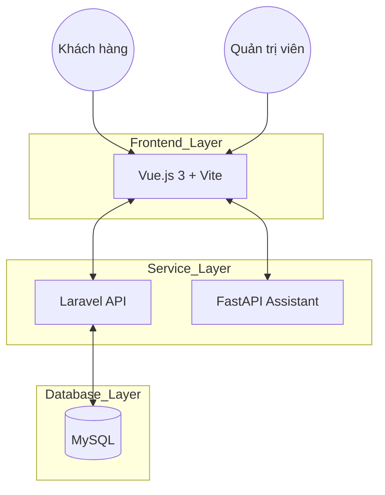
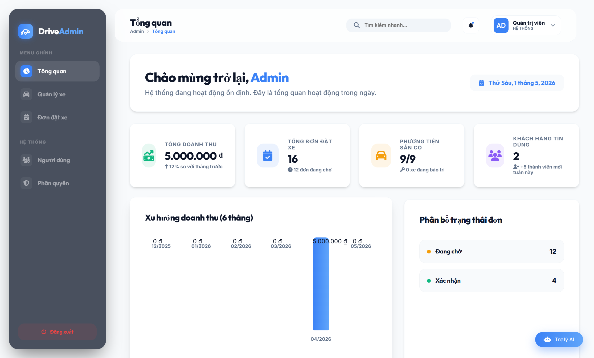
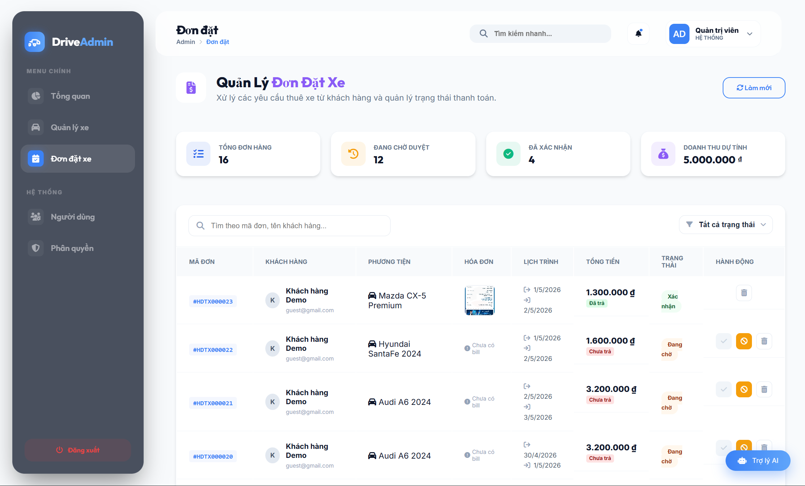

# 🚗 Car Rental Website - Midnight Luxury 🌟

<p align="center">
  
</p>

<p align="center">
  <a href="https://laravel.com/" target="_blank"></a>
  <a href="https://vuejs.org/" target="_blank"></a>
  <a href="https://fastapi.tiangolo.com/" target="_blank"></a>
  <a href="https://vitejs.dev/" target="_blank"></a>
  <a href="https://www.mysql.com/" target="_blank"></a>
</p>

---

## 📖 Giới thiệu
**Midnight Luxury** là một nền tảng thuê xe trực tuyến hiện đại, được thiết kế với phong cách tối giản và sang trọng (cảm hứng từ VinFast). Dự án cung cấp trải nghiệm thuê xe mượt mà, tích hợp trợ lý ảo AI để hỗ trợ khách hàng 24/7.

## ✨ Tính năng nổi bật
- 🏎️ **Hệ thống đặt xe:** Quy trình đặt xe nhanh chóng với các bước xác thực thông tin rõ ràng.
- 🤖 **Trợ lý AI:** Chatbot thông minh hỗ trợ giải đáp thắc mắc và hướng dẫn quy trình thuê xe.
- 📊 **Admin Dashboard:** Quản lý xe, đơn hàng, người dùng và phân quyền chuyên nghiệp.
- 📱 **Responsive Design:** Giao diện tối ưu hoàn hảo trên mọi thiết bị (Mobile, Tablet, Desktop).
- 🗺️ **Quản lý địa điểm:** Tích hợp bản đồ và chọn địa điểm đón/trả xe linh hoạt.
- 💳 **Thanh toán QR:** Tích hợp thanh toán qua mã QR tiện lợi và an toàn.

## 🧠 Trợ lý ảo AI Thông minh
Điểm đặc biệt của dự án là hệ thống **AI Assistant** tự phát triển, không chỉ là chatbot thông thường:
- **Xử lý ngôn ngữ tự nhiên (NLP):** Sử dụng thư viện `nltk` và mô hình Neural Network tùy chỉnh.
- **Tự đào tạo (Self-trained):** Có khả năng học từ file `intents.json` để nhận diện ý định khách hàng.
- **Tốc độ phản hồi cực nhanh:** Được triển khai trên nền tảng FastAPI giúp phản hồi gần như ngay lập tức.
- **Tích hợp sâu:** Kết nối trực tiếp với luồng đặt xe để hỗ trợ thông tin theo thời gian thực.


## 🛠️ Công nghệ sử dụng
- **Frontend:** Vue.js 3, Vite, Axios, Tailwind CSS (hoặc CSS tùy chỉnh).
- **Backend:** Laravel 10+, MySQL.
- **AI Assistant:** FastAPI, Python, NLP.
- **Tools:** Git, Composer, NPM.

## 🏗️ Kiến trúc hệ thống
Dự án được xây dựng theo mô hình **Microservices-ready architecture** với sự phân tách rõ ràng:



## 📁 Cấu trúc dự án
```text
Car_Rental_Website/
├── BE/                # Backend Laravel (API & Business Logic)
├── FE/                # Frontend Vue.js (UI/UX)
├── AI_Assistant/      # Trợ lý ảo AI (Python, NLP, FastAPI)
├── README.md          # Tài liệu dự án
└── composer.phar      # Quản lý dependency PHP
```


## 🚀 Hướng dẫn cài đặt

### 1. Yêu cầu hệ thống
- PHP >= 8.1
- Node.js & NPM
- Python 3.9+
- Composer

### 2. Cài đặt Backend (BE)
```bash
cd BE
composer install
cp .env.example .env
php artisan key:generate
php artisan migrate --seed
php artisan serve
```

### 3. Cài đặt Frontend (FE)
```bash
cd FE
npm install
npm run dev
```

### 4. Cài đặt AI Assistant
```bash
cd AI_Assistant
pip install -r requirements.txt
python main.py
```

## 📸 Hình ảnh giao diện

### 🌐 Giao diện Người dùng (Client)
| Trang chủ | Danh sách xe |
| :---: | :---: |
|  |  |

### ⚡ Giao diện Quản trị (Admin)
| Trang chủ | Quản lý hóa đơn |
| :---: | :---: |
|  |  |

## 🤝 Liên hệ
- **Tác giả:** HungNguyen3205
- **Email:** namhung03022005@gmail.com
- **GitHub:** [HungNguyen3205](https://github.com/HungNguyen3205)

---
<p align="center">Made with ❤️ for a better Car Rental experience.</p>
